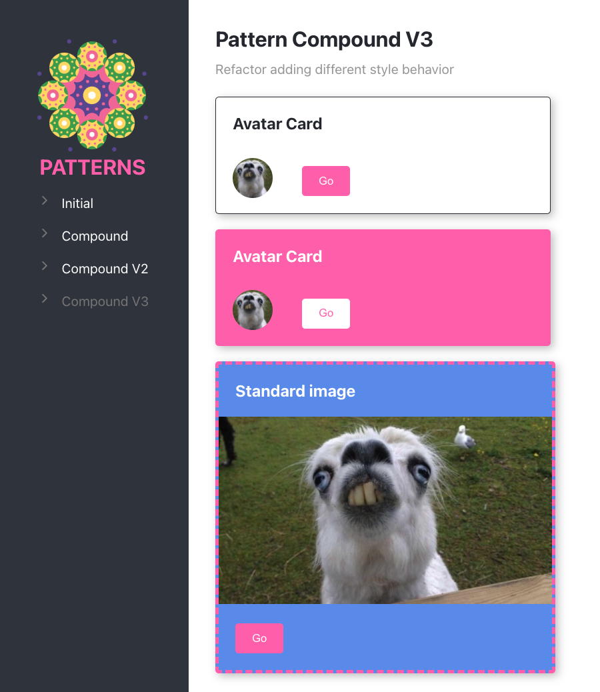

# Pattern Reactjs

- [Initial Component](./src/initial/)

- [Compound Component](./src/compound/)
- [Compound Component refactor v2](./src/compoundv2/)

- [Compound Component refactor v3](./src/compoundv3/)


## Getting Started

```bash
npm install
```
or 
```bash
yarn install
```

## Available Scripts

In the project directory, you can run:

```bash
npm start
```

Runs the app in the development mode.\
Open [http://localhost:3000](http://localhost:3000) to view it in your browser.

The page will reload when you make changes.\
You may also see any lint errors in the console.

## Dependencies

- [styled-components](https://styled-components.com/)
- [react Router v6](https://reactrouter.com/docs/en/v6/getting-started/overview)

##

